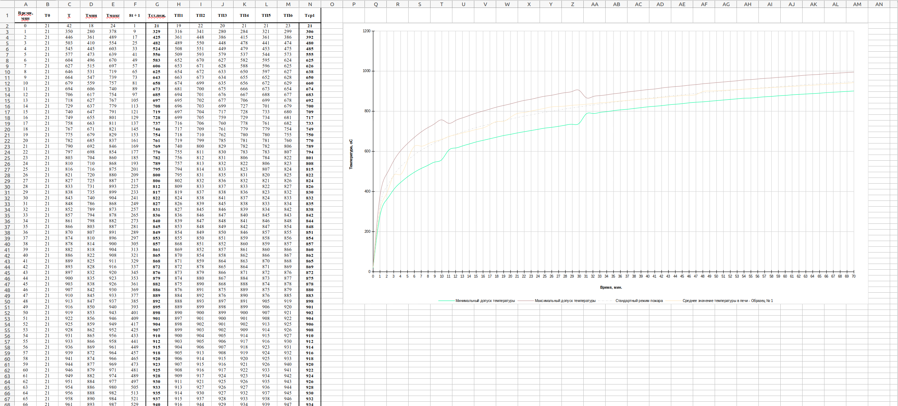
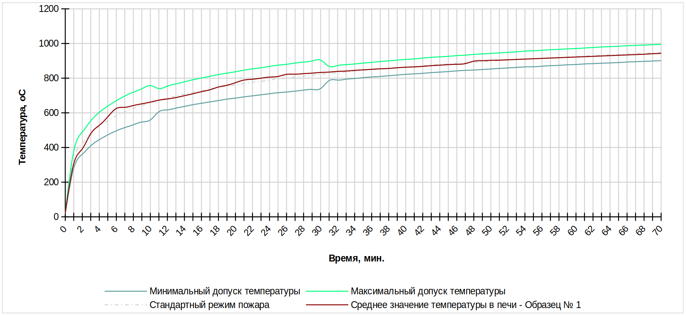

# FIRE-RES
Fire-resistance report generator

Данный проект предназначен для генерации отчетов о тестировании строительных конструкций
и элементов инжерерных систем на огнестойкость в соответствии с [ГОСТ 30247.0-94](https://github.com/therealmonE/fire-res/blob/main/docs/%D0%93%D0%9E%D0%A1%D0%A2%2030247.0-94.pdf).

**Оглавление**

- [Пример отчета](#пример-отчета)
- [Установка и запуск](#установка-и-запуск)
- [Конфигурация](#конфигурация)
  - [Время](#время)
  - [Температура](#температура)
    - [Температура окружающей среды](#температура-окружающей-среды)
    - [Коэффициенты максимально допустимой температуры](#коэффициенты-максимально-допустимой-температуры)
    - [Коэффициенты минимально допустимой температуры](#коэффициенты-минимально-допустимой-температуры)
  - [Образцы](#образцы)
    - [Интерполяция](#интерполяция)
      - [Точки интерполяции](#точки-интерполяции)
      - [Метод интерполяции](#метод-интерполяции)
    - [Случайные точки](#случайные-точки)
    - [Количество термопар](#количество-термопар)
   - [Пример полной конфигурации](#пример-полной-конфигурации)
    

## Пример отчета

<p align="center">
</p>

## Установка и запуск

 1. Скачайте и установите [jre-11](https://www.oracle.com/java/technologies/javase/jdk11-archive-downloads.html)
 1. Скачайте и распакуйте [архив]()
 2. Установите параметры генерации в файле `generation.conf` (см. [Конфигурация](#конфигурация))
 3. Запустите скрипт `run.bat` (Для пользователей Windows) или `run.sh` (Для пользователей Linux / MacOs)
 4. **В следующих версиях ожидается реализация GUI**
 
 ## Конфигурация
 
 ### Время
 
 Время тестирования задается аттрибутом `time`. Сгенерированные значения будут лежать в диапазоне `[0, time - 1]`.
 
 ```
 time : 71
 ```
 
 ### Температура
 
 Основные параметры температуры задаются в секции `temperature`.
 
 ```
 temperature: {
  environmentTemperature: ...
  minAllowedTempCoefficients: ...
  maxAllowedTempCoefficients: ...
 }
 ```
 
 #### Температура окружающей среды
 
 Температура окружающей среды задается аттрибутом `temperature.environmentTemperature`.
 
 ```
 temperature: {
  environmentTemperature: 21
 }
 ```
 
 #### Коэффициенты максимально допустимой температуры
 
 Коэффициенты максимально допустимой температуры относительно стандартного режима пожара задается в массиве `temperature.maxAllowedTempCoefficients`. 
 
 - `from` - начальное время (включительно)
 - `to` - конечное время (включительно)
 - `value` - значение коэффициента
 
 ```
 temperature: {
  maxAllowedTempCoefficients: [
    {from: 0, to: 10, value: 1.15}
    {from: 11, to: 30, value: 1.1}
    {from: 31, to: 360, value: 1.05}
  ]
 }
 ```
 
 #### Коэффициенты минимально допустимой температуры
 
  Коэффициенты минимально допустимой температуры относительно стандартного режима пожара задается в массиве `temperature.minAllowedTempCoefficients`. 
 
 - `from` - начальное время (включительно)
 - `to` - конечное время (включительно)
 - `value` - значение коэффициента
 
 ```
 temperature: {
  minAllowedTempCoefficients: [
    {from: 0, to: 10, value: 0.85}
    {from: 11, to: 30, value: 0.9}
    {from: 31, to: 360, value: 0.95}
  ]
 }
 ```
 
 ### Образцы
 
 Параметры генерации каждого образца тестирования задаются в массиве `samples`. Массив может включать в себя несколько элементов, 
 для каждого будут сгенерированы температуры термопар их среднее значение.
 
 ```
 samples: [
  {

    interpolation: ...
    randomPoints: ...
    thermocoupleCount: ...
  }
  {

    interpolation: ...
    randomPoints: ...
    thermocoupleCount: ...
  }
 ]
 ```
 
 #### Интерполяция
 
 Для каждого образца необходимо (***Временно***) указать параметры интерполяции, задающие внешний вид функции ***среднего значения температуры в печи***.  
 Данные параметры задаются в секции `samples.interpolation`.
 
 ```
 samples: [
  {
    interpolation: {
      interpolationPoints: ...
      interpolationMethod: ...
    }
  }
 ]
 ```
 
 ##### Точки интерполяции
 
 Известные точки интерполяции, задающий внешний вид функции задаются в массиве `samples.interpolation.interpolationPoints`. 
 ***Внимание!*** В текущей версии интерполированная по заданнным точкам функция не должна выходить за границы максимально / минимально допустимой температуры.
 Добавьте больше промежуточных точек для корректной работы программы.
 
 ```
 samples: [
  {
    interpolation: {
      interpolationPoints: [
        {time: 0, temperature: 21}
        {time: 1, temperature: 306}
        {time: 2, temperature: 392}
        {time: 3, temperature: 480}
        {time: 6, temperature: 625}
        {time: 18, temperature: 749}
        {time: 21, temperature: 789}
        {time: 26, temperature: 822}
        {time: 48, temperature: 898}
        {time: 49, temperature: 901}
        {time: 70, temperature: 943}
      ]
    }
   }
 ]
 ```
 
 ##### Метод интерполяции
 
 Метод интерполяции функции ***среднего значения температуры в печи*** для образца задается аттрибутом `samples.interpolation.interpolationMethod`.
 ***Внимание!*** В данной версии поддерживается только линейный (LINEAR) метод интерполяции, т.к. только этот метод обеспечивает строго растущую функцию.
 
 ```
 samples: [
  {
    interpolation: {
      interpolationMethod: "LINEAR"
    }
  }
]
 ```
 
 #### Случайные точки
 
 Чтобы сделать функцию ***среднего значения температуры в печи*** для образца более нелинейной, можно обогатить график случайными точками.
 Параметры случайных точек задаются в секции `samples.randomPoints`.
 
 - `enrichWithRandomPoints` - Флаг, указывающий на то, обогащать ли график случайными значениями (`true`/`false`)
 - `newPointChance` - Шанс появления случайной точки на графике (от `0` до `1`)
 
 ```
 samples: [
  {
    randomPoints: {
      enrichWithRandomPoints: true,
      newPointChance: 0.7
    }
  }
]
 ```
 
 #### Количество термопар
 
 Для каждой секции необходимо указать количество термопар, по которыми считается среднее значение температуры. 
 Количество термопар задается аттрибутом `samples.thermocoupleCount`.
 
 ```
 samples: [
  {
    thermocoupleCount: 6
  }
]
 ```
 
 ### Пример полной конфигурации
 
 Полная конфигурация может иметь следующий вид:
 
 ```
 time: 71

temperature: {
  environmentTemperature: 21
  maxAllowedTempCoefficients: [
    {from: 0, to: 10, value: 1.15}
    {from: 11, to: 30, value: 1.1}
    {from: 31, to: 360, value: 1.05}
  ]
  minAllowedTempCoefficients: [
    {from: 0, to: 10, value: 0.85}
    {from: 11, to: 30, value: 0.9}
    {from: 31, to: 360, value: 0.95}
  ]
}

samples: [
  {
    interpolation: {
      interpolationPoints: [
        {time: 0, temperature: 21}
        {time: 1, temperature: 306}
        {time: 2, temperature: 392}
        {time: 3, temperature: 480}
        {time: 6, temperature: 625}
        {time: 18, temperature: 749}
        {time: 21, temperature: 789}
        {time: 26, temperature: 822}
        {time: 48, temperature: 898}
        {time: 49, temperature: 901}
        {time: 70, temperature: 943}
      ]
      interpolationMethod: "LINEAR"
    }
    randomPoints: {
      enrichWithRandomPoints: true,
      newPointChance: 0.7
    }
    thermocoupleCount: 6
  }
]
 ```
 
 По данной конфигурации генерируется следующий график:
 
 <p align="center">
  </p>
